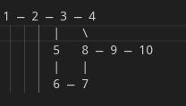

# 🚂 Железнодорожная логистическая задача оптимизации формирования поездов

> **Цель**: минимизировать *makespan* (время, за которое все вагоны достигнут пунктов назначения) при жёстких ограничениях на инфраструктуру.

---

## 📌 Постановка задачи

Дан полигон из **N станций**, соединённых рельсовыми путями (неориентированный граф).  
На станциях находятся вагоны с заданными пунктами назначения.

### Ограничения:
- ⏱️ Перемещение между соседними станциями занимает **1 день**.  
- 🚂 С каждой станции можно отправить **не более одного поезда в сутки**.  
- 📏 Длина поезда: **от 5 до 30 вагонов** (иначе отправка невозможна).  
- 🧱 Вагоны могут сколь угодно долго ожидать на промежуточных станциях.  
- 🎯 Целевая функция:  
  \[
  \min \left( \max_{w \in \text{вагоны}} t_{\text{arrival}}(w) \right)
  \]
  — минимизация **максимального** времени доставки (*makespan*).

### Исходная задача на 10 станций:  (данный полигон используеться в network_10_base.json )


 У нас есть полигон железных дорог, структура полигона. Станция 1 соединяется только со станцией 2, станция 2 соединяется со станцией 3 и со станцией 1, станция 3 соединяется со станцией 2 и 4, 5, 8. Станция 4 соединяется только со станцией 3. Станция 5 соединяется со станцией 3 и 6. Станция 6 соединяется со станцией 5 и 7, станция 7 соединяется со станцией 6 и 8. Станция 8 соединяется со станцией 9, 7, 3. Станция 9 соединяется со станцией 8 и станцией 10. Станция 10 соединяется со станцией 9. На этих станциях имеются вагоны назначением на разные станции. На станции 1 есть 10 вагонов на станцию 7, 20 вагонов на станцию 10, 5 вагонов на станцию 2, 10 вагонов на станцию 6. На станции 2 есть 20 вагонов на станцию 5, 10 вагонов на станцию 7, 5 вагонов на станцию 4, 10 вагонов на станцию 9. На станции 3 имеются 10 вагонов на станцию 4, 20 вагонов на станцию 6, 10 вагонов на станцию 10 и 5 вагонов на станцию 9. На 4-ой станции есть 5 вагонов на станцию 2, 10 вагонов на станцию 3, 20 вагонов на станцию 8, 5 вагонов на станцию 10. На 5-ой станции 20 вагонов на станции 2, 10 вагонов на станции 6, 10 вагонов на станции 9, 10 вагонов на станцию 7. На станции 6 10 вагонов на станцию №1, 20 вагонов на 3-ую, 10 вагонов на 6-ую, 10 вагонов на 8-ую. На станции 7 10 вагонов на 1-ую, 10 на 2-ую, 10 вагонов 5. На станции 8 20 вагонов на 4-ую, 10 на 6-ую, 10 на 10-ую. На станции 9 10 вагонов на 2-ую, 5 вагонов на 3-ую, 10 вагонов на 5-ую. Ст. 10 имеет 20 вагонов на 1-ую, 10 вагонов на 3-ую, 5 вагонов на 4-ую, 10 вагонов на 8-ую. Каждое движение между станциями занимает 1 день, если вагон, назначенный на станцию 3, приехал на станцию 2, то он будет сутки стоять, чтобы можно было его отправить, и так на каждую станцию. Задача — придумать оптимальный план формирования поездов с каждой станции для минимизации времени следования вагонов. Условия: максимальная длина поезда может составлять 30 вагонов, минимальная — 5. 

 1 — 2 — 3 — 4
        |   \
        5   8 — 9 — 10
        |   |
        6 — 7



graph LR
    1 --- 2
    2 --- 3
    3 --- 4
    3 --- 5
    3 --- 8
    5 --- 6
    6 --- 7
    7 --- 8
    8 --- 9
    9 --- 10

classDef station fill:#4A90E2, color:white, stroke:#333, font-weight:bold;
class 1,2,3,4,5,6,7,8,9,10 station;


\begin{tikzpicture}[
    station/.style={circle, draw=blue!80, fill=blue!20, thick, minimum size=1.2cm}
]
\node[station] (1) at (0,0) {1};
\node[station] (2) at (2,0) {2};
\node[station] (3) at (4,0) {3};
\node[station] (4) at (6,0) {4};
\node[station] (5) at (3,-1.5) {5};
\node[station] (6) at (3,-3) {6};
\node[station] (7) at (5,-3) {7};
\node[station] (8) at (5,-1.5) {8};
\node[station] (9) at (7,-1.5) {9};
\node[station] (10) at (9,-1.5) {10};

\draw (1) -- (2) -- (3) -- (4);
\draw (3) -- (5) -- (6) -- (7) -- (8) -- (3);
\draw (8) -- (9) -- (10);
\end{tikzpicture}


На станциях размещено **405 вагонов** (10 уже на месте), например:  
- На ст.1: 10 → ст.7, 20 → ст.10, 5 → ст.2, 10 → ст.6  
- На ст.2: 20 → ст.5, 10 → ст.7, 5 → ст.4, 10 → ст.9  
- … (полные данные — в JSON)

---

## 🛠️ Методика решения

Для решения применяется **Constraint Programming (CP)** с использованием библиотеки **Google OR-Tools CP-SAT**.

### Ключевые особенности реализации:
- ✅ **Адаптивный поиск по времени** — без фиксированного горизонта планирования.  
- ✅ **Полная доставка** — задача считается решённой, только если *все* вагоны достигли назначения.  
- ✅ **Масштабируемость** — поддержка разреженных графов (не все номера станций обязаны быть последовательными).  
- ✅ **Многопоточность** — автоматическое использование всех доступных ядер (`num_search_workers`).  
- ✅ **Чистый вывод** — только итоговые метрики, без технического лога.

Алгоритм:
1. Последовательно проверяет `T = 8, 9, 10, ...` дней.  
2. Для каждого `T` строит CP-модель и пытается найти выполнимый план формирования.  
3. При успехе — возвращает минимальный `T` и план отправок.  
4. При таймауте — возвращает лучшее найденное решение (если есть).

---

## 📁 Данные

В репозитории представлены предварительно сгенерированные тестовые наборы:

| Файл | Станций | Вагонов | Описание |
|------|---------|---------|----------|
| `network_original.json` | 10 | 405 | Исходный полигон (описан в задаче) |
| `network_10.json` | 10 | 405 | То же, что original |
| `network_20.json` | 20 | 810 | 2 копии + 3 межблоковые связи |
| `network_30.json` | 30 | 1215 | 3 копии + 5 связей |
| `network_40.json` | 40 | 1620 | 4 копии + 6 связей |
| `network_50.json` | 50 | 2025 | 5 копий + 8 связей |
| `network_200.json` | 200 | 8100 | 20 копий, 200 активных станций |

Генерация новых сетей — через `generate_network_X.py` (параметры: `N_BLOCKS`, `BLOCK_SIZE`).

---

## ▶️ Как запустить

1. Установите зависимости:
   ```bash
   pip install ortools


# Настройте параметры в solve_adaptive.py

INPUT_FILE = "network_original.json"  # или любой другой
TIME_LIMIT_SEC = 600.0                # лимит времени (сек)
MAX_WORKERS = 28                      # число ядер

Запустите:
python solve_adaptive.py

### Пример вывода:

Активных станций: 10 | Вагонов: 405
Лимит: 600.0 сек | Ядер: 28

🏆 Решение найдено за 0.6 сек:
  makespan = 8 дней
  активных станций: 10, вагонов: 405


## Таблица результатов решения задачи 

  Станций     Вагонов     Лимит (сек)       Результат      makespan      Время (сек)

  10            405         600             ✅ OPTIMAL         8             0.6

  20            810         600             ✅ OPTIMAL         8             2.4

  30            1229        600             ✅ OPTIMAL         11           194.3

  40            1642        600             ✅ OPTIMAL         10            87.2

  50            2025        180             ❌ TIMEOUT          —            182.4

  50             2025       600             ❌ TIMEOUT          —             602.1

